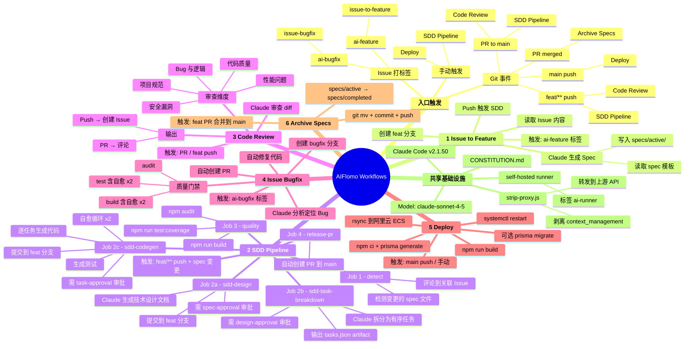

# AIFlomo Workflow 思维导图

```mermaid
mindmap
  root((AIFlomo Workflows))
    **入口触发**
      Issue 打标签
        ai-feature
          issue-to-feature
        ai-bugfix
          issue-bugfix
      Git 事件
        feat/** push
          SDD Pipeline
          Code Review
        PR to main
          SDD Pipeline
          Code Review
        main push
          Deploy
        PR merged
          Archive Specs
      手动触发
        SDD Pipeline
        Deploy

    **1 Issue to Feature**
      触发: ai-feature 标签
      读取 Issue 内容
      Claude 生成 Spec
        读取 spec 模板
        写入 specs/active/
      创建 feat 分支
      Push 触发 SDD

    **2 SDD Pipeline**
      触发: feat/** push + spec 变更
      Job 1 - detect
        检测变更的 spec 文件
        评论到关联 Issue
      Job 2a - sdd-design
        需 spec-approval 审批
        Claude 生成技术设计文档
        提交到 feat 分支
      Job 2b - sdd-task-breakdown
        需 design-approval 审批
        Claude 拆分为有序任务
        输出 tasks.json artifact
      Job 2c - sdd-codegen
        需 task-approval 审批
        逐任务生成代码
        生成测试
        自愈循环 x2
        提交到 feat 分支
      Job 3 - quality
        npm audit
        npm run build
        npm run test:coverage
      Job 4 - release-pr
        自动创建 PR 到 main

    **3 Code Review**
      触发: PR / feat push
      Claude 审查 diff
      审查维度
        代码质量
        Bug 与逻辑
        安全漏洞
        性能问题
        项目规范
      输出
        PR → 评论
        Push → 创建 Issue

    **4 Issue Bugfix**
      触发: ai-bugfix 标签
      Claude 分析定位 Bug
      自动修复代码
      质量门禁
        audit
        build 含自愈 x2
        test 含自愈 x2
      创建 bugfix 分支
      自动创建 PR

    **5 Deploy**
      触发: main push / 手动
      rsync 到阿里云 ECS
      npm ci + prisma generate
      可选 prisma migrate
      npm run build
      systemctl restart

    **6 Archive Specs**
      触发: feat PR 合并到 main
      specs/active → specs/completed
      git mv + commit + push

    **共享基础设施**
      self-hosted runner
        标签 ai-runner
      strip-proxy.js
        剥离 context_management
        转发到上游 API
      Claude Code v2.1.50
      CONSTITUTION.md
      Model: claude-sonnet-4-5
```
